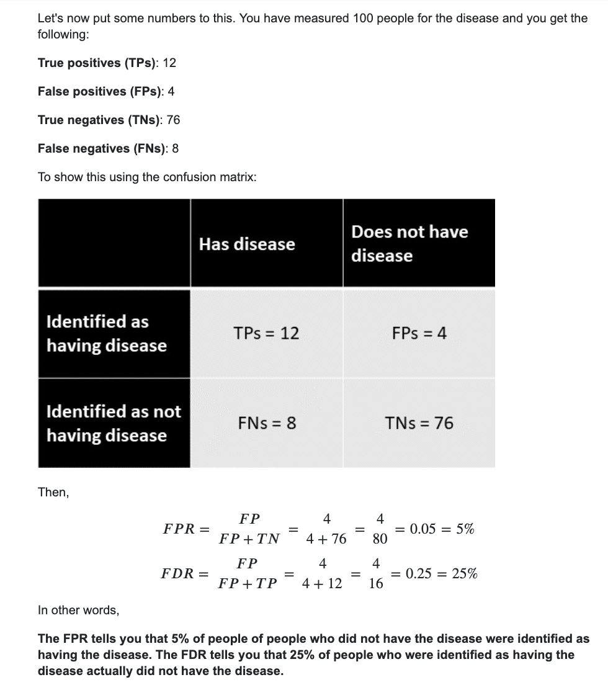

# Classification Metrics

## Accuracy
- Overall, how often is the classifier correct?
- Percent of total that are correctly classified
    - (TP + TN) / Total 
    
## Precision
- When it predicts yes, how often is it correct?
    - **TP / (Predicted YES)**
    
- ratio of the number of correctly labeled responses to the total labeled

## Recall (Sensitivity)
- ratio of the number of correctly labeled responses to the total that should have been labeled
- of all the ones that were **labeled POSITIVE**, which were **really Positive**?
    - **TP / (Actual YES)**    
    - TP / (TP + FN)
    
### Recall
45 patients in your test set have cancer. Your model identifies 37 of them as having cancer.  
37/45 represents the **recall** which is:  of all the true, which were recalled?

## Specificity
- Specificity – how good a test is at **avoiding false alarms**. A test can cheat and maximize this by always returning “negative”.
    - TN / N

## Misclassification Rate
- (FP + FN) / Total

## F1 score
- F1 score (also F-score or F-measure) is a measure of a test's accuracy. It considers both the precision p and the recall r of the test to compute the score
- The F1 score can be interpreted as a weighted average of the precision and recall, where an F1 score reaches its best value at 1 and worst at 0.

---

## False Positive Rate vs False Discovery Rate

The **False Positive Rate** (FPR) is telling you the proportion of all the people who do not have the disease who will be identified as having the disease.

The FDR is telling you the proportion of all the people identified as having the disease who do not have the disease.

https://stats.stackexchange.com/questions/336455/fpr-false-positive-rate-vs-fdr-false-discovery-rate

